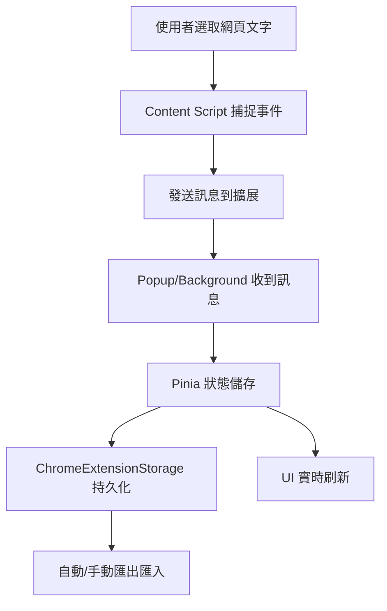

# 1133-web-extension-chatcontext 專題分享

本專題為一款基於 Chrome 付個元件，可用於 Chatgpt 等其他生成式聊天服務的關鍵字管理工具，支援文字選取快速添加、分類管理、離線儲存同步、多標籤頁資料同步、資料匯入匯出等功能。此 README 從代碼選型、設計架構、業務邏輯、前後端重點代碼進行介紹，適合作為大學專題技術分享參考。

---

## 一、代碼選型與技術棧

- **主語言**：JavaScript（44.9%）、Vue 3（41.7%）
- **輔助語言**：HTML（8.4%）、CSS（5%）
- **框架/庫**：
  - [Vue 3](https://vuejs.org/)：組件化前端框架，負責 UI 與狀態管理。
  - [Pinia](https://pinia.vuejs.org/)：Vue 官方推薦的狀態管理庫。
  - Chrome Extension API：與瀏覽器擴展環境互動。
- **工程工具**：Vite（推測）、Element Plus（UI 組件，視專案實際使用）

---

## 二、設計架構

### 1. 前端架構

- **組件化設計**：採用 Vue 3 Options API/Composition API。
- **狀態管理**：以 Pinia 管理全域 todo 狀態，方便組件間共享。
- **UI 渲染**：彈性響應式數據驅動，支援多類型分類（如 explain、analyze、summary）。
- **Popup/Content Script**：區分擴展內嵌頁與注入網頁腳本。

### 2. 後端/儲存邏輯

- **ChromeExtensionStorage 工具類**：封裝 Chrome 擴展儲存 API，支援自動判斷是否在擴展環境，fallback 至 localStorage。
- **資料同步**：支援多標籤頁同步與本地自動保存，實現資料一致性。
- **資料匯入/匯出**：JSON 檔案格式，便於備份與轉移。

### 3. 主要流程架構圖



---

## 三、核心業務邏輯

### 1. 資料管理與分類

- 項目可分為多個分類（如 explain、analyze、summary），每個分類有對應的計算屬性。
- 支援新增、刪除、編輯、分類調整、完成狀態切換。

### 2. 自動儲存與同步

- 使用 watch 深度監聽 todoItems，變更時自動防抖保存（300ms）。
- 支援 Chrome Storage 多標籤頁同步。

### 3. 資料匯入匯出

- 匯出：將當前 todoItems 以 JSON 檔格式下載。
- 匯入：從檔案讀取，校驗結構自動補齊必要欄位。

---

## 四、重點代碼介紹

### 1. 狀態管理（Pinia + Composition API）

```javascript
import { defineStore } from 'pinia'
import { ref, computed, watch, nextTick } from 'vue'
import { ChromeExtensionStorage } from '../utils/ChromeExtensionStorage.js'

export const useTodoStore = defineStore('todo', () => {
  const storage = new ChromeExtensionStorage()
  const todoItems = ref([])
  const isLoading = ref(true)
  // 初始化、分類、CRUD、同步等函式見下方
  // ...
})
```

### 2. 主要業務函式（src/stores/todoStore.js）

- 新增待辦
```javascript
function addTodo(newTodoLabel) {
  // 分配分類、生成 id 與時間戳
  const newTodo = {
    id: 'todo-' + crypto.randomUUID(),
    label: newTodoLabel,
    done: false,
    createdAt: new Date().toISOString(),
    updatedAt: new Date().toISOString(),
    category: targetCategory // 自動分配分類
  }
  todoItems.value.push(newTodo)
}
```

- 編輯、刪除、分類移動
```javascript
function editTodo(todoId, newLabel) { /* ... */ }
function deleteTodo(todoId) { /* ... */ }
function setTodoCategory(todoId, category) { /* ... */ }
```

- 狀態切換
```javascript
function updateDoneStatus(todoId) {
  const todo = todoItems.value.find(item => item.id === todoId)
  if (todo) {
    todo.done = !todo.done
    todo.updatedAt = new Date().toISOString()
  }
}
```

- 自動儲存與多頁同步
```javascript
watch(todoItems, async (newTodos) => {
  if (!isLoading.value) {
    await debouncedSave([...newTodos])
  }
}, { deep: true })

storage.onStorageChanged((newValue, oldValue) => {
  // 檢測其他頁面的同步變化
})
```

### 3. ChromeExtensionStorage 封裝（src/utils/ChromeExtensionStorage.js）

- 根據環境自動選擇 API
```javascript
async load() {
  if (this.isExtension) {
    const result = await chrome.storage.local.get([this.storageKey])
    return result[this.storageKey]?.todos || []
  } else {
    const savedData = localStorage.getItem(this.storageKey)
    return JSON.parse(savedData)?.todos || []
  }
}
```
- 匯入檔案數據
```javascript
importFromFile(file) {
  // FileReader 讀取→JSON parse→驗證陣列
}
```

### 4. Content Script（public/content.js）

- 捕捉使用者網頁選取文字、避免在教學平台誤觸、與擴展溝通
```javascript
// 判斷問題網站，避免誤觸
const isProblematicSite = () => { /* ... */ }
if (!chrome || !chrome.runtime) { /* ... */ }
```

---

## 五、前端與後端分工說明

- **前端重點**：
  - Vue+Pinia 狀態管理
  - 動態分類渲染
  - 用戶互動（如通知、選取文字、操作回饋）
  - 測試頁面（test-page.html）便於功能驗證

- **後端/擴展儲存重點**：
  - ChromeExtensionStorage 封裝
  - 多頁同步與本地資料一致性
  - 資料備份與還原

---

## 六、專案亮點與學習收穫

- 深入理解 Chrome Extension 與 Web 前端融合設計
- 前後端分離與資料一致性處理
- 前端組件化、狀態管理經驗
- 實作自動化測試與用戶體驗優化

---

## 七、啟動方式（簡述）

1. `npm install` 安裝依賴
2. 使用 Vite/webpack 打包（視專案設置）
3. 將 `dist` 資料夾加載到 Chrome 擴展
4. 測試頁面可用 `test-page.html` 驗證功能

---

## 八、結語

本專題適合有興趣於 Chrome 擴展開發、Vue 前端技術、資料同步與管理的同學參考。歡迎 star、fork 與提出 issue！

---
